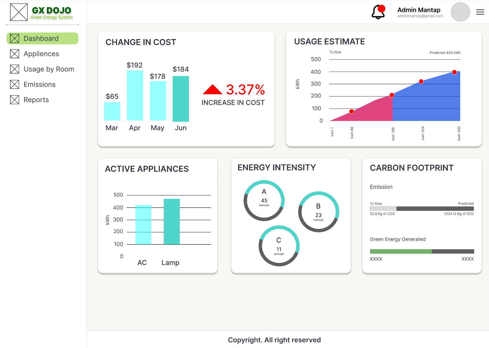

# IOT Energy Phase 3 | GX DOJO GREEN

Kelompok PBL IF19, yang beranggotakan: 

<br>
3312301064 - Ahmad Candra Ramadhan
<br>
3312301011 - Elvira Fitriayu Ardina 
<br>
3312301016 - Marsya Huriyah Ibtisamah
<br>
3312301060 - Muhammad Farrel Ardanto
<br>


## About the App
<!-- gambar taro di src -->
 

Proyek "IoT Energy Phase 3" merupakan sebuah proyek kolaborasi yang bertujuan untuk  memenuhi permintaan PT Panasonic. Tujuan utamanya adalah menciptakan maket atau miniatur yang mendemonstrasikan penggunaan energi bersih berbasis teknologi IoT. Ruang lingkup proyek ini mencakup, namun tidak terbatas pada, hal-hal berikut:
<br>
- Pengendalian otomatis suhu AC berdasarkan jumlah orang dalam ruangan.
- Pengendalian otomatis posisi dan intensitas cahaya lampu.
- Pemantauan emisi CO2.
- Pengembangan maket green transformation.
<br>
Dirancang sebagai media pembelajaran komprehensif, proyek ini berfokus pada manajemen energi yang efisien dengan memanfaatkan perangkat Internet of Things (IoT) dalam implementasinya. Hasil akhir dari proyek ini akan berupa maket, dashboard website, dan serangkaian komponen IoT yang saling terintegrasi, membuat pengalaman belajar menjadi lebih praktis dan mendalam.
<br>
Implementasi proyek ini diharapkan dapat memberikan wawasan tentang potensi teknologi IoT dalam mengoptimalkan penggunaan energi. Selain menggabungkan aspek-aspek seperti pengendalian suhu, pencahayaan, dan emisi CO2, maket green transformation juga memiliki fungsi penting untuk memvisualisasikan bagaimana teknologi ini dapat diterapkan dalam skala yang lebih besar nantinya. Proyek ini memberikan gambaran nyata tentang masa depan yang lebih ramah lingkungan.


## Initial Setup to Launch the App

Note : 
- Sudah menginstall xampp, composer, laravel, vs code, node.js dan npm
- Siapkan 1 folder untuk nyimpan project
- Buka folder pada VS Code
- Lakukan integrasi dibawah pada terminal vs code (ctrl + `)
- Arahkan path sesuai folder diawal (cd 'nama folder')

1. **Clone the Project**: Start by cloning the project from your friend's GitHub repository to your local machine.

   ```bash
   git clone https://github.com/itsachar12/IoT-Phase-3-S4.git

2. **Navigate to the project directory**
   ```bash
   cd IoT-Phase-3

3. **Install Composer Dependencies**: Navigate to the newly cloned project directory and install Composer dependencies.

   ```bash
   composer install
   ```

4. **Update Composer Autoload and Dependencies**
   
   ```bash
   composer dump-autoload
   composer update
   ```

   
5. **NPM Install**:

   ```bash
   npm install 
   ```

6. **.env file configuration**:

   - Rename `.env-example` to `.env`.
   - Set `APP_DEBUG=true` in the `.env` file.


7. **Generate New Application Key**:

   ```bash
   php artisan key:generate
   ```

8. **Launch The App**
   - Add new terminal for running laravel
   ```bash
   php artisan serve
   ```
   - Add 1 more terminal for running node
   ```bash
   npm run dev
   ```

* Note : soo there are 2 terminal running for running the website!!!
